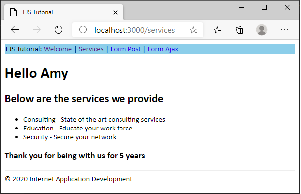
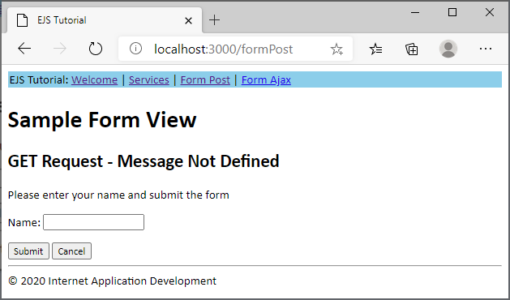
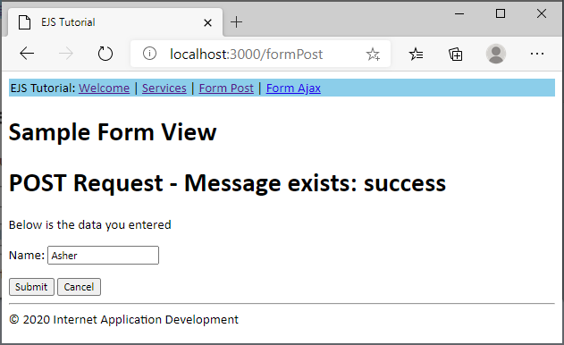

# Overview
This tutorial provides step-by-step instructions for setting up a simple web site using [EJS](https://ejs.co/) in a Node project.  It is to supplement class discussion and may not cover details of every step.

Assumptions:
- Using VSCode
- Using Express Framework

# What is EJS?
[EJS](https://ejs.co/) is a simple templating language that lets you generate HTML markup with plain JavaScript.  
Reference
- [EJS Site](https://ejs.co/)
- [EJS GitHub](https://github.com/mde/ejs)

# Steps

## File/Folder Structure
At completion of the project, your file/folder structure will be as follows
```
  - css
    -- styles.css
  - node_modules
  - views
    -- _footer.ejs
    -- _header.ejs
    -- formAjax.ejs
    -- formPost.ejs
    -- services.ejs
    -- index.ejs
  - index.js
  - package-lock.json
  - package.json
```

## 1. Create a Node Project with Express and EJS modules
1. Launch VSCode
2. Create a folder for the project.  
   - Folder name: **tutejs**  
3. Open **tutejs** folder in Integrated Terminal
4. Initiate a Node project  
   ``` npm init ``` and answer the questions  
   or  
   ``` npm init -y ``` to accept defaults
   
   - Add the "start" script to the generated package.json file:  
     ``` "start": "node index.js", ```  
     package.json contents (similar, depending on your answers)
     ```js
     {
      "name": "tutejs",
      "version": "1.0.0",
      "description": "EJS Tutorial",
      "main": "index.js",
      "scripts": {
        "start": "node index.js",
        "test": "echo \"Error: no test specified\" && exit 1"
      },
      "author": "Asher",
      "license": "ISC"
     }
     ```  
 5. Intall Express and EJS modules  
    ``` npm install express ejs ```
    
## 2. Create EJS Views and Stylesheet
### EJS
We will create header and footer views to be included in our other pages.  
Create documents in the **views** directory  
1. _header.ejs content:
```js
<!DOCTYPE html>
<html lang="en">
<head>
    <meta charset="UTF-8">
    <meta name="viewport" content="width=device-width, initial-scale=1.0">
    <title>EJS Tutorial</title>
    <link href="/styles.css" rel="stylesheet" type="text/css">
</head>
<body>
    <table width="100%">
        <tr>
            <td>EJS Tutorial: <a href="/">Welcome</a> |
                <a href="/services">Services</a> |
                <a href="/formPost">Form Post</a> |
                <a href="/formAjax">Form Ajax</a> 
            </td>
        </tr>
    </table>
```  
2. _footer.ejs content:
```js
    <hr>
    <footer>
        &copy 2020 Internet Application Development
    </footer>
</body>
</html>
```  
3. The index page will be our start page.  
index.ejs content:
```js
<%- include("_header") -%>

<h1>Welcome to our site</h1>

<%- include("_footer") -%>
```  
### Stylesheet
For now, we will create a simple style sheet.  
In a later tutorial, we will use [bootstrap](https://getbootstrap.com/).  
1. Create a folder for the stylesheet
   - Folder name: **css**  
2. Create a file 
   - File name: styles.css
   content:
   ```css
   * {
    font-family: Calibri;
   }

   table {
    background-color:  skyblue;
   }
   ```

## 3. Setup The Server  
Copy the content below to the **index.js** file.   
  - Content:
  ```js
  // Load packages and access services
  const express = require("express");
  const app = express();

  // Setup view engine to ejs
  app.set('view engine', 'ejs');

  // Serve static content directly
  app.use(express.static("css"));

  // Setup routes

  // Route to welcome page
  app.get('/', (request, response) => {
      response.render("index");
  });

  // Start listening to incoming requests
  // If process.env.PORT is not defined, port number 3000 is used
  const listener = app.listen(process.env.PORT || 3000, () => {
      console.log(`Your app is listening on port ${listener.address().port}`);
  });
  ```  
  ### Notes  
  - We must setup the server to use the EJS emplate engine  
    ``` app.set('view engine', 'ejs'); ```  
  - No need to ``` require("ejs")``` because Express handles this
  - No need to ``` app.use(express.static("views")); ``` because it is the default for EJS  
  
  ### Start the server  
  Start the server with  
  ``` npm start ``` or ``` node index.js ```  
  Test it: [http://localhost:3000/](http://localhost:3000)  
  You should see the following:  
  
  
  ## 4. Using EJS  
  View the [EJS](https://ejs.co/) site for details.  Below are the various tags:  
  - <% 'Scriptlet' tag, for control-flow, no output
  - <%_ ‘Whitespace Slurping’ Scriptlet tag, strips all whitespace before it
  - <%= Outputs the value into the template (HTML escaped)
  - <%- Outputs the unescaped value into the template
  - <%# Comment tag, no execution, no output
  - <%% Outputs a literal '<%'
  - %> Plain ending tag
  - -%> Trim-mode ('newline slurp') tag, trims following newline
  - _%> ‘Whitespace Slurping’ ending tag, removes all whitespace after it  
  
  We will use the **services.ejs** template to experiment receiving data from the server.  
  Add a route to services.ejs passing it a name.  
  Add the following to index.js:  
  ```js
  // Route to services page
  app.get('/services', (request, response) => {
      //Data
      const name = "Amy";
      response.render("services", {name: name});
  });
  ```
  Create the following file (in the views directory)  
  - Filename: services.ejs  
    content:
    ```js
    <%- include("_header") -%>

    <h1>Hello <%= name %>!</h1>
    <h2>We are happy to provide you with our services</h2>

    <%- include("_footer") -%>
    ```  
  Review the following:  
  - How the variable **name** is declared and passed in index.js
  - How the variable is used in services.ejs
  
  Stop and Start your server and go to the serivces page.  
  Test it: [http://localhost:3000/](http://localhost:3000) and click on Services or  
  [http://localhost:3000/services](http://localhost:3000/services)  
  You should see the following:  
  
  
  ### Passing more data (object with array)  
  Experiment passing additional data.
  Modify /services route in **index.js** per below:  
  ```js
  // Route to services page
  app.get('/services', (request, response) => {
      //Data
      const name = "Amy";
      const data = {
          years: 5,
          services: [
              {
                  name: "Consulting",
                  desc: "State of the art consulting services"
              },
              {
                  name: "Education",
                  desc: "Educate your work force"
              },
              {
                  name: "Security",
                  desc: "Secure your network"
              }
          ]
      };
      response.render("services",
          {
              name: name,
              data: data
          });
  }); 
  ```  
  Note:  
  - Created a **data** object containing **years** and **services** array
  - Passing data in response.render
  
  Modify **services.ejs** per below:
  ```js
  <%- include("_header") -%>

  <h1>Hello <%= name %></h1>
  <h2>Below are the services we provide</h2>
  <ul>
      <% data.services.forEach(service => { %>
          <li>
              <%= service.name %> - <%= service.desc %>
          </li>
      <% }); %>
  </ul>

  <h3>Thank you for being with us for <%= data.years %> 
      <% if(data.years > 1) { %> 
          years 
      <% } else { %> 
          year 
      <% };%>
  </h3>

  <%- include("_footer") -%>
  ```  
  Note / Review sytnax used for:
  - Loop
  - If condition  
  As you can see, this is regular JavaScript embedded in the HTML page.  Hence, Embedded JavaScript.
  
  Stop and Start your server and go to the serivces page.  
  Test it: [http://localhost:3000/](http://localhost:3000) and click on Services or  
  [http://localhost:3000/services](http://localhost:3000/services)  
  You should see the following:  
  

  ## 5. Working with Forms
  In this section, we will demonstrate processing forms.  We will experiment with:  
  - Both synchronous and asynchronous HTTP requests
  - Form enctype (encoded type)
    - application/x-www-form-urlencoded - This is the default.  Characters are endoced before sent.
    - multipart/form-data - No characters are encoded. 
    
  For illustration purposes, we will call the same form view for both GET and POST requests.  
  In the form, we'll use JavaScript to check if variables have been passed back (POST).  If so, we'll populate the form with the data entered.  
  
  ### Form POST  
  In this scenario, we will not use AJAX, just the traditional POST.  
  We will create GET and POST routes to **formPost**, passing variables back in the POST call.  
  This is simply a demonstration for you to understand how to retrieve data from a form and send it to another page.  Also, to perform EJS logic in the template.  It is not best practice.  
  Add the following routes to **index.js**
  ```js
  // GET Route to form page
  app.get('/formPost', (request, response) => {
      response.render("formPost");
  });

  // POST Route to form page
  app.post('/formPost', (request, response) => {
      const message = "success";
      // Get name passed from the form
      const name = request.body.name;
      //Call formPost passing message and name
      response.render("formPost", 
          {
              message: message,
              name: name
          });
  });
  ```  
  Note the following for the POST route
  - Passing two variables back: message and name
    - name is the value entered in the form
  
  In order to parse the form using ```request.body.variableName```, you must add middleware to your **index.js** file.  
  Add the following (prior to the routes):  
  ```js
  // Add middleware to parse defaul urlencoded form
  app.use(express.urlencoded({ extended: false }));
  ```  
  
  Create the formPost file.  
  - Filename: formPost.ejs
    content:
    ```js
    <%- include("_header") -%>

    <h1>Sample Form View</h1>

    <% if (typeof message === 'undefined') { %>
        <h2>GET Request - Message Not Defined</h2>
        <p>Please enter your name and submit the form</p>
        <% name = ""; %> 
    <% } else { %>
        <h1>POST Request - Message exists: <%= message %></h1>
        <p>Below is the data you entered</p>
        <%  name = name; %>
    <% } %>

    <form action="/formPost" method="POST">
        <p>
            <label for="name">Name</label>:
            <input type="text" name="name" id="name" value="<%= name %>" required>
        </p>
        <input type="submit" value="Submit">
        <input type="reset" value="Cancel">
    </form>

    <%- include("_footer") -%>
    ```  
    Notes
    - If block logic checks if **message** variable exists.  It does not from a GET request.  In this case, we set name to blank.
    - If messge does exist, we set **name** to the value entered in the form
    - The input tag value attribute is <%= name %>
    - There are other ways to handle this.  For example, pass empty values for variables in the GET route and populated values in the POST route.  This way, logic is not performed in the view.  
    
  Stop and Start your server and go to the Form Post page.  
  Test it: [http://localhost:3000/](http://localhost:3000) and click on Form Post  
  You should see the following:  
    
  
  Enter your name and press submit.  You should see the following (with your name):  
     
  
### Enhance the form / Change route logic
Make the following enahancements:
- Add an e-mail and payment option (radio button) to the form
- Change route logic to send data to the views (both GET and PUT)  

Updated index.js file:
```js
// GET Route to form page
app.get('/formPost', (request, response) => {
    const message = "get";
    const data = {
        name: "",
        email: "",
        payment: ""
    };
    response.render("formPost", 
        {
            message: message,
            data: data
        });

});

// POST Route to form page
app.post('/formPost', (request, response) => {
    const message = "post";
    // Send form data back to the form
    const data = {
        name: request.body.name,
        email: request.body.email,
        payment: request.body.payment
    }
    //Call formPost passing message and name
    response.render("formPost", 
        {
            message: message,
            data: data
        });
});
```  

Updated formPost.ejs file:  
```js
<%- include("_header") -%>

<h1>Sample Form View</h1>

<% if (message === "get") { %>
    <p>Please enter your information below and submit the form</p>
<% } else { %>
    <p>Below is the data you entered</p>
<% } %>

<form action="/formPost" method="POST">
    <p>
        <label for="name">Name</label>:
        <input type="text" name="name" id="name" value="<%= data.name %>" required>
    </p>
    <p>
        <label for="email">Email</label>:
        <input type="email" name="email" id="email" value="<%= data.email %>" required placeholder="name@domain">
    </p>
    <p>
        Payment Type:<br>
        <input type="radio" name="payment" id="cash" value="cash">
        <label for="cash">Cash</label>
        <br>
        <input type="radio" name="payment" id="cc" value="cc">
        <label for="cc">Credit Card</label>
        <br>
        <input type="radio" name="payment" id="gpay" value="gpay">
        <label for="gpay">Google Pay</label>
        <br>
        <input type="radio" name="payment" id="appay" value="appay">
        <label for="appay">Apple Pay</label>
    </p>
    <input type="submit" value="Submit">
    <input type="reset" value="Cancel">
</form>

<script>document.getElementById("<%= data.payment %>").checked = true;</script>

<%- include("_footer") -%>
```  
Note:
- Note ```<script>document.getElementById("<%= data.payment %>").checked = true;</script>``` at the bottom of the file.  

Stop and Start your server and go to the Form Post page.  
Test it: [http://localhost:3000/](http://localhost:3000) and click on Form Post  

### Form enctype: multipart/form-data
Change a single line in your form per the below:
``` <form enctype="multipart/form-data" action="/formPost" method="POST"> ```  

Stop and Start your server and go to the Form Post page.  
Test it: [http://localhost:3000/](http://localhost:3000) and click on Form Post  

Notice that you are not getting the data back.  In order to process **multipart/form-data**, use **multer** package.  
Install multer package:  
```npm install multer ```  

Edit **index.js** to require multer, access multer services, and modify the /formPost POST route.  
Add the following towards the top of the file:  
```js
const multer = require("multer");
const upload = multer();
```  
Modify the /formPost POST route as follows (chagne the first line):
```js
// POST Route to form page
//app.post('/formPost', (request, response) => {
app.post('/formPost', upload.array(), (request, response) => {    
    const message = "post";
    // Send form data back to the form
    const data = {
        name: request.body.name,
        email: request.body.email,
        payment: request.body.payment
    }
    //Call formPost passing message and name
    response.render("formPost", 
        {
            message: message,
            data: data
        });
});
```

Stop and Start your server and go to the Form Post page.  
Test it: [http://localhost:3000/](http://localhost:3000) and click on Form Post  
The application works!  

Summary:  
You processed forms using the default application/x-www-form-urlencoded and the multipart/form-data encoding types.  

Optional:  
You can revert the form back to the default encodying type: application/x-www-form-urlencoded.

### Form AJAX
When using AJAX, we prevent the default synchronous POST.  The form will retain the data the user entered.  
In this scenario, since we are not doing anything with the data at the server, we will simply modify the message and provide feedback at the bottom of the form.  

Update index.js (add routes for AJAX call):  
```js
// GET Route to form page
app.get('/formAjax', (request, response) => {
    response.render("formAjax")
});

// POST Route to form page
app.post('/formAjax', upload.array(), (request, response) => {    
    // Send form data back to the form
    const data = {
        name: request.body.name,
        email: request.body.email,
        payment: request.body.payment
    };
    //Call formPost passing message and name
    response.json(data);
});
```

Create formAjax.ejs:  
```js
<%- include("_header") -%>

<h1>Sample Form View</h1>

<p id="message">Please enter your information below and submit the form</p>

<form>
    <p>
        <label for="name">Name</label>:
        <input type="text" name="name" id="name" required>
    </p>
    <p>
        <label for="email">Email</label>:
        <input type="email" name="email" id="email" required placeholder="name@domain">
    </p>
    <p>
        Payment Type:<br>
        <input type="radio" name="payment" id="cash" value="cash">
        <label for="cash">Cash</label>
        <br>
        <input type="radio" name="payment" id="cc" value="cc">
        <label for="cc">Credit Card</label>
        <br>
        <input type="radio" name="payment" id="gpay" value="gpay">
        <label for="gpay">Google Pay</label>
        <br>
        <input type="radio" name="payment" id="appay" value="appay">
        <label for="appay">Apple Pay</label>
    </p>
    <input type="submit" value="Submit">
    <input type="reset" value="Cancel">
</form>
<p id="result"></p>

<script>
// Typically, if the script is large, we place it in a separate file
//   For demonstrations, it is included in the same file.
// Handle form submission
document.querySelector("form").addEventListener("submit", e => {
  // Cancel default behavior of sending a synchronous POST request
  e.preventDefault();
  // Create a FormData object, passing the form as a parameter
  const formData = new FormData(e.target);
  // Send form data to the server with an asynchronous POST request
  fetch("/formAjax", {
    method: "POST",
    body: formData
  })
    .then(response => response.json())
    .then(data => {
      document.getElementById("message").textContent = "Thank you for submitting the form";
      document.getElementById("result").innerHTML = `${data.name}, we received your order. <br>
        Order status will be sent to ${data.email}.  <br>
        Thanks for using ${data.payment} payment type.`;
      //document.getElementById("data.payment").checked = true;
    })
    .catch(err => {
        document.getElementById("message").textContent = `Error: ${err.message}`;
    });
});
</script>

<%- include("_footer") -%>
```  

Stop and Start your server and go to the Form Post page.  
Test it: [http://localhost:3000/](http://localhost:3000) and click on Form Post  
Notice the difference in behavior.

Screen shots.  Get formAjax:  
[FormAjax](images/ejs_formAjax.png)  

Post formAjax:  
[FormAjax](images/ejs_formAjax2.png)  


## 6. View Network Traffic / Compare regular Post vs. AJAX Post  
From your browswer, open Developer Tools --> Network  
Test your application on both form types.  Review the request and response messages.  
Notice how small the response is for AJAX calls.  

## 7.  Post your solution to GitHub  
If you previously created a repository in GitHub and cloned it to your local environment, commit your changes and push the code to GitHub.  
Otherwise, create a .gitignore file as follows.
- Filename: .gitignore
  content:
  ``` node_modules/ ```  
  
  Create a repository from your code, commit, and push to GitHub.  
  
  
