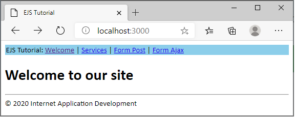
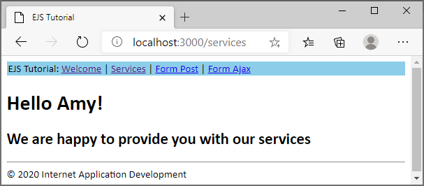

# Overview
This tutorial provides step-by-step instructions for setting up a simple web site using [EJS](https://ejs.co/) in a Node project.  It is to supplement class discussion and may not cover details of every step.

Assumptions:
- Using VSCode
- Using Express Framework

# What is EJS?
[EJS](https://ejs.co/) is a simple templating language that lets you generate HTML markup with plain JavaScript.  
Reference
- [EJS Site](https://ejs.co/)
- [EJS GitHub](https://github.com/mde/ejs)

# Steps

## File/Folder Structure
At completion of the project, your file/folder structure will be as follows
```
  - css
    -- styles.css
  - node_modules
  - views
    -- _footer.ejs
    -- _header.ejs
    -- formAjax.ejs
    -- formPost.ejs
    -- services.ejs
    -- index.ejs
  - index.js
  - package-lock.json
  - package.json
```

## 1. Create a Node Project with Express and EJS modules
1. Launch VSCode
2. Create a folder for the project.  
   - Folder name: **tutejs**  
3. Open **tutejs** folder in Integrated Terminal
4. Initiate a Node project  
   ``` npm init ``` and answer the questions  
   or  
   ``` npm init -y ``` to accept defaults
   
   - Add the "start" script to the generated package.json file:  
     ``` "start": "node index.js", ```  
     package.json contents (similar, depending on your answers)
     ```js
     {
      "name": "tutejs",
      "version": "1.0.0",
      "description": "EJS Tutorial",
      "main": "index.js",
      "scripts": {
        "start": "node index.js",
        "test": "echo \"Error: no test specified\" && exit 1"
      },
      "author": "Asher",
      "license": "ISC"
     }
     ```  
 5. Intall Express and EJS modules  
    ``` npm install express ejs ```
    
## 2. Create EJS Views and Stylesheet
### EJS
We will create header and footer views to be included in our other pages.  
Create documents in the **views** directory  
1. _header.ejs content:
```js
<!DOCTYPE html>
<html lang="en">
<head>
    <meta charset="UTF-8">
    <meta name="viewport" content="width=device-width, initial-scale=1.0">
    <title>EJS Tutorial</title>
    <link href="/styles.css" rel="stylesheet" type="text/css">
</head>
<body>
    <table width="100%">
        <tr>
            <td>EJS Tutorial: <a href="/">Welcome</a> |
                <a href="/services">Services</a> |
                <a href="/formPost">Form Post</a> |
                <a href="/formAjax">Form Ajax</a> 
            </td>
        </tr>
    </table>
```  
2. _footer.ejs content:
```js
    <hr>
    <footer>
        &copy 2020 Internet Application Development
    </footer>
</body>
</html>
```  
3. The index page will be our start page.  
index.ejs content:
```js
<%- include("_header") -%>

<h1>Welcome to our site</h1>

<%- include("_footer") -%>
```  
### Stylesheet
For now, we will create a simple style sheet.  
In a later tutorial, we will use [bootstrap](https://getbootstrap.com/).  
1. Create a folder for the stylesheet
   - Folder name: **css**  
2. Create a file 
   - File name: styles.css
   content:
   ```css
   * {
    font-family: Calibri;
   }

   table {
    background-color:  skyblue;
   }
   ```

## 3. Setup The Server  
Copy the content below to the **index.js** file.   
  - Content:
  ```js
  // Load packages and access services
  const express = require("express");
  const app = express();

  // Setup view engine to ejs
  app.set('view engine', 'ejs');

  // Serve static content directly
  app.use(express.static("css"));

  // Setup routes

  // Route to welcome page
  app.get('/', (request, response) => {
      response.render("index");
  });

  // Start listening to incoming requests
  // If process.env.PORT is not defined, port number 3000 is used
  const listener = app.listen(process.env.PORT || 3000, () => {
      console.log(`Your app is listening on port ${listener.address().port}`);
  });
  ```  
  ### Notes  
  - We must setup the server to use the EJS emplate engine  
    ``` app.set('view engine', 'ejs'); ```  
  - No need to ``` require("ejs")``` because Express handles this
  - No need to ``` app.use(express.static("views")); ``` because it is the default for EJS  
  
  ### Start the server  
  Start the server with  
  ``` npm start ``` or ``` node index.js ```  
  Test it: [http://localhost:3000/](http://localhost:3000)  
  You should see the following:  
  
  
  ## 4. Using EJS  
  View [EJS](https://ejs.co/) for details.  Below are the various tags:  
  - <% 'Scriptlet' tag, for control-flow, no output
  - <%_ ‘Whitespace Slurping’ Scriptlet tag, strips all whitespace before it
  - <%= Outputs the value into the template (HTML escaped)
  - <%- Outputs the unescaped value into the template
  - <%# Comment tag, no execution, no output
  - <%% Outputs a literal '<%'
  - %> Plain ending tag
  - -%> Trim-mode ('newline slurp') tag, trims following newline
  - _%> ‘Whitespace Slurping’ ending tag, removes all whitespace after it  
  
  We will use the **services.ejs** template to experiment receiving data from the server.  
  Add a route to services.ejs passing it a name.  
  Add the following to index.js:  
  ```js
  // Route to services page
  app.get('/services', (request, response) => {
      //Data
      const name = "Amy";
      response.render("services", {name: name});
  });
  ```
  Create the following file (in the views directory)  
  - Filename: services.ejs  
    content:
    ```js
    <%- include("_header") -%>

    <h1>Hello <%= name %>!</h1>
    <h2>We are happy to provide you with our services</h2>

    <%- include("_footer") -%>
    ```  
  Review the following:  
  - How the variable **name** is declared and passed in index.js
  - How the variable is used in services.ejs
  
  Stop and Start your server and go to the serivces page.  
  Test it: [http://localhost:3000/](http://localhost:3000) and click on Services or  
  [http://localhost:3000/services](http://localhost:3000/services)  
  You should see the following:
  
  
  ### Passing more data (object with array)  
  Experiment passing additional data.
  Modify /services route in **index.js** per below:  
  ```js
  // Route to services page
  app.get('/services', (request, response) => {
      //Data
      const name = "Amy";
      const data = {
          years: 5,
          services: [
              {
                  name: "Consulting",
                  desc: "State of the art consulting services"
              },
              {
                  name: "Education",
                  desc: "Educate your work force"
              },
              {
                  name: "Security",
                  desc: "Secure your network"
              }
          ]
      };
      response.render("services",
          {
              name: name,
              data: data
          });
  }); 
  ```  
  Note:  
  - Created a **data** object containing **years** and **services** array
  - Passing data in response.render
  
  Modify **services.ejs*** per below:
  ```js
  <%- include("_header") -%>

  <h1>Hello <%= name %></h1>
  <h2>Below are the services we provide</h2>
  <ul>
      <% data.services.forEach(service => { %>
          <li>
              <%= service.name %> - <%= service.desc %>
          </li>
      <% }); %>
  </ul>

  <h3>Thank you for being with us for <%= data.years %> 
      <% if(data.years > 1) { %> 
          years 
      <% } else { %> 
          year 
      <% };%>
  </h3>

  <%- include("_footer") -%>
  ```  
  Note / Review sytnax used for:
  - Loop
  - If condition
  As you can see, this is regular JavaScript embedded in the HTML page.  Hence, Embedded JavaScript.
  
  

  
  
  
  
  
  
  
